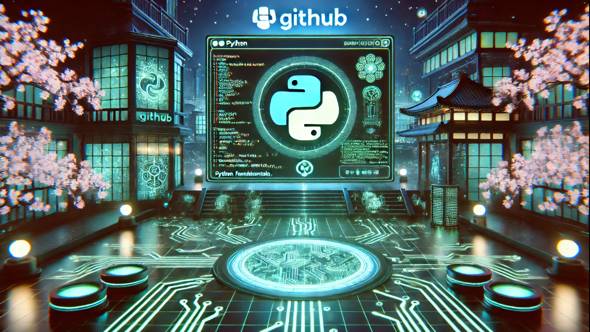

# Python Fundamentals

The "Python Fundamentals" repository is a beginner-friendly guide to learning Python programming. It includes hands-on examples, interactive code snippets, and well-documented tutorials that cover essential concepts such as variables, data types, loops, functions, and object-oriented programming.

Whether you're a novice coder or someone brushing up on foundational skills, this repository offers structured lessons to build your knowledge step-by-step. Additionally, it features mini-projects, exercises, and challenges to reinforce learning and encourage practical application.

Dive into the world of Python and start your programming journey today with "Python Fundamentals"!
